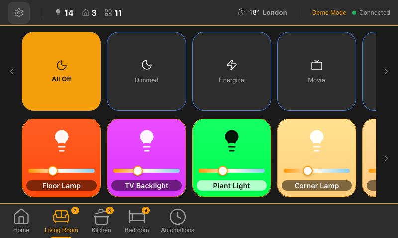

# Philips Hue Light Control

A modern React web application for controlling Philips Hue lights locally using the official Hue API v2. Features a responsive interface with visual light controls, room organization, scene management, and real-time motion zone detection. Built with a **backend-heavy architecture** where the backend handles business logic and exposes a simplified v1 REST API with WebSocket support for real-time updates.



## Features

### Core Functionality

- **True Color Display**: Light buttons show actual bulb colors with mathematical color space conversion (xy/mirek → RGB)
- **Information Dashboard**: At-a-glance summary showing total lights on, room count, and scene count
- **Brightness Indicators**: Live brightness percentage displayed on each light and room average
- **Room Status Badges**: See "{X} of {Y} lights on" for each room at a glance
- **Zone Support**: Control Hue zones (light groups spanning multiple rooms) with compact bar UI
- **Motion Zone Detection**: Always-visible inline bar showing MotionAware zones with real-time status indicators
- **Room Organization**: Lights automatically grouped by room with modern card layout
- **Scene Management**: Select and activate scenes for each room and zone
- **Master Controls**: Turn all lights in a room or zone on/off with one button

### Modern Architecture

- **WebSocket Real-Time Updates**: Instant state synchronization across all connected devices
- **Session-Based Authentication**: Secure token-based sessions with automatic refresh
- **Backend Business Logic**: Colors, shadows, and statistics pre-computed on server
- **Simplified API**: Frontend makes 1-2 calls instead of 4-6 (67-83% reduction)
- **Responsive Design**: Device-specific layouts (iPad: 4×2, iPhone: 2×4, Raspberry Pi 7": 4×2)
- **Centralized UI Text**: UI_TEXT constants for consistency and easy maintenance

### Authentication & Discovery

- **Bridge Discovery**: Automatically find your Hue Bridge or enter IP manually
- **Link Button Authentication**: Simple guided flow with visual feedback
- **Persistent Sessions**: Sessions saved in browser localStorage with auto-recovery
- **Session Auto-Refresh**: Tokens refresh automatically before expiration
- **Multi-Client Support**: Second client connects instantly using server-stored credentials (no re-pairing needed)
- **Demo Mode**: Try the app without a Hue Bridge using `?demo=true` URL parameter

### Technical Features

- **CORS Solution**: Backend handles CORS and self-signed HTTPS certificates
- **Multi-Machine Support**: Access from any device on your network
- **Centralized Configuration**: All settings managed through config.json
- **Modern API v2**: Uses the latest Philips Hue API for future-proof functionality
- **Comprehensive Testing**: 952 tests (395 frontend + 557 backend) with integration test suite

## Prerequisites

- **Philips Hue Bridge** (v2 recommended) with lights configured
- **Node.js** (v16 or higher)
- Server machine on the **same local network** as your bridge
- Modern web browser (Chrome, Firefox, Safari, Edge)

## Quick Start

### 1. Install Dependencies

```bash
npm install
```

### 2. Development Mode

Run both frontend and backend servers with hot reload:

```bash
npm run dev
```

This starts:

- **Frontend** on http://localhost:5173 (React dev server with hot reload)
- **Backend** on http://localhost:3001 (API proxy server)

Open your browser to http://localhost:5173

### 3. Production Deployment

Build and start the production server:

```bash
npm run deploy
```

Or step by step:

```bash
npm run build              # Build frontend
npm run build:backend      # Copy frontend to backend
npm run start              # Start production server
```

The server runs on http://0.0.0.0:3001 and serves both the API and frontend.

### 4. Access from Other Devices

Once the server is running, access it from any device on your network:

```
http://192.168.68.86:3001
```

Replace `192.168.68.86` with your server's local IP address.

To find your server's IP:

```bash
ifconfig | grep "inet " | grep -v 127.0.0.1
```

### 5. Initial Setup

1. **Discover or Enter Bridge IP**: Use auto-discovery or manually enter your bridge's IP address
2. **Press Link Button**: Press the physical button on top of your Hue Bridge
3. **Authenticate**: Click "I Pressed the Button" within 30 seconds
4. **Session Created**: A session token is automatically created and saved
5. **Control Your Lights**: View and control all your lights organized by room with real-time WebSocket updates

### 6. Demo Mode (No Bridge Required)

Try the app without a Hue Bridge:

```
http://localhost:5173/?demo=true     # Development
http://192.168.1.100:3001/?demo=true # Production (use your server IP)
```

**Demo mode features:**

- 2 rooms with 6 lights (Living Room, Bedroom)
- 4 scenes (Bright, Relax, Energize, Nightlight)
- 2 zones (Downstairs, Upstairs)
- 2 motion zones with simulated detection
- Mock weather data (London)
- Full interactivity: toggle lights, change brightness, activate scenes
- State persists in memory (resets on server restart)

**How it works:**

- Frontend detects `?demo=true` and sends `X-Demo-Mode: true` header
- Backend returns mock data instead of connecting to a real bridge
- WebSocket receives mock updates every 15 seconds
- All API endpoints work identically to real mode

## Architecture

### Monorepo Structure

The app is organized as a monorepo with separate frontend and backend workspaces:

```
philips-hue-connector/
├── config.json                 # Centralized configuration
├── package.json                # Root workspace manager
├── frontend/                   # React frontend workspace
│   ├── package.json
│   ├── vite.config.js         # Vite config (reads config.json)
│   ├── vitest.config.js       # Test configuration
│   ├── stryker.conf.json      # Mutation testing config
│   ├── TESTING.md             # Testing documentation
│   ├── index.html
│   ├── dist/                  # Build output (gitignored)
│   └── src/
│       ├── main.jsx
│       ├── App.jsx
│       ├── App.css
│       ├── components/
│       │   ├── BridgeDiscovery.jsx
│       │   ├── Authentication.jsx
│       │   ├── MotionZones.jsx
│       │   └── LightControl/
│       │       ├── index.jsx          # Main container
│       │       ├── LightButton.jsx    # Individual light button
│       │       ├── RoomCard.jsx       # Room grouping
│       │       ├── ZoneCard.jsx       # Compact zone control bar
│       │       ├── SceneSelector.jsx  # Scene dropdown
│       │       └── DashboardSummary.jsx
│       ├── utils/             # Utility functions
│       │   └── validation.js  # IP validation (frontend-only)
│       ├── constants/         # Centralized constants
│       │   ├── uiText.js      # UI_TEXT - All user-facing text
│       │   ├── polling.js
│       │   ├── storage.js
│       │   ├── colors.js
│       │   ├── validation.js
│       │   └── messages.js
│       ├── services/
│       │   ├── hueApi.js      # v1 API client (calls backend endpoints)
│       │   └── mockData.js    # Demo mode data
│       ├── hooks/             # Custom React hooks
│       │   ├── useHueBridge.js
│       │   ├── useDemoMode.js
│       │   ├── useHueApi.js
│       │   └── usePolling.js
│       └── test/
│           └── setup.js       # Test environment setup
└── backend/                    # Express backend workspace
    ├── package.json
    ├── server.js              # Express server (v1 API + WebSocket + static files)
    ├── middleware/            # Express middleware
    │   ├── auth.js            # Session & demo mode authentication
    │   └── demoMode.js        # X-Demo-Mode header detection
    ├── routes/v1/             # v1 API routes
    │   ├── auth.js            # Authentication endpoints
    │   ├── dashboard.js       # Dashboard data endpoint
    │   ├── lights.js          # Light control endpoints
    │   ├── rooms.js           # Room control endpoints
    │   ├── zones.js           # Zone control endpoints
    │   ├── scenes.js          # Scene activation endpoint
    │   ├── settings.js        # Settings API endpoints
    │   └── weather.js         # Weather API endpoint
    ├── services/              # Business logic layer
    │   ├── hueClient.js       # Real Hue Bridge API client
    │   ├── mockHueClient.js   # Mock client for demo mode
    │   ├── mockData.js        # Demo mode mock data
    │   ├── hueClientFactory.js # Returns real or mock client
    │   ├── dashboardService.js # Dashboard data aggregation
    │   ├── roomService.js     # Room hierarchy & statistics
    │   ├── zoneService.js     # Zone hierarchy & statistics
    │   ├── motionService.js   # Motion sensor parsing
    │   ├── statsService.js    # Dashboard statistics
    │   ├── sessionManager.js  # Session token management
    │   ├── settingsService.js # Per-session settings storage
    │   ├── weatherService.js  # Weather API with caching
    │   └── websocketService.js # WebSocket server & state updates
    ├── utils/                 # Utility functions
    │   ├── colorConversion.js # Color space conversion
    │   ├── stateConversion.js # State format conversion
    │   ├── validation.js      # Input validation
    │   └── errors.js          # Custom error classes
    ├── constants/             # Backend constants
    │   ├── timings.js         # Intervals and timeouts
    │   └── errorMessages.js   # Error message constants
    ├── scripts/
    │   └── copy-frontend.js   # Build script
    ├── test/                  # Backend tests
    │   ├── services/          # Service layer tests
    │   ├── middleware/        # Middleware tests
    │   └── routes/            # API route tests
    └── public/                # Served frontend (gitignored)
```

### Configuration File

All hostnames, IPs, and ports are centralized in `config.json`:

```json
{
  "server": {
    "port": 3001,
    "host": "0.0.0.0",
    "corsEnabled": true
  },
  "hue": {
    "discoveryEndpoint": "https://discovery.meethue.com/"
  },
  "development": {
    "frontendPort": 5173,
    "backendPort": 3001
  }
}
```

**Benefits:**

- Single source of truth for configuration
- Easy to modify without code changes
- Backend exposes `/api/config` endpoint for frontend access
- Can be overridden by environment variables

### How It Works

**Backend-Heavy Architecture:**
The backend is the brains of the operation:

- **Business Logic**: Processes Hue API responses, builds room hierarchies, calculates statistics
- **Color Computation**: Converts xy/mirek to RGB, applies warm dim blending, generates shadows
- **Data Aggregation**: Combines 4-6 Hue API calls into single unified responses
- **WebSocket Server**: Pushes real-time updates to all connected clients
- **Session Management**: Handles authentication tokens with auto-refresh

The frontend is a thin presentation layer:

- **Simple Rendering**: Displays pre-computed data from backend
- **User Events**: Sends interactions to backend via v1 API
- **WebSocket Client**: Receives real-time updates without polling

**Development Mode:**

- Frontend: Vite dev server on port 5173 with hot reload
- Backend: Express server on port 3001 with v1 REST API + WebSocket
- Vite proxies `/api/*` requests to backend automatically

**Production Mode:**

- Backend serves both API and frontend on single port (3001)
- Frontend uses relative URLs (same origin = no CORS issues)
- Access from any machine using server's IP address

**Performance Benefits:**

- Frontend API calls: **4-6 → 1-2** (67-83% reduction)
- Network latency: **Multiple round trips → Single round trip**
- Frontend complexity: **Reduced by ~1,300 lines** (business logic moved to backend)
- Updates: **30-second polling → Instant WebSocket push**

**CORS Solution:**
The Philips Hue Bridge doesn't send CORS headers and uses self-signed HTTPS certificates. The backend server:

- Communicates with Hue Bridge on behalf of frontend
- Adds proper CORS headers for browser access
- Accepts the bridge's self-signed SSL certificate
- Listens on all network interfaces (0.0.0.0)

**No browser extensions or workarounds needed!**

### Technology Stack

**Frontend:**

- **React 18** - UI framework with hooks
- **Vite 6** - Fast build tool and dev server
- **WebSocket** - Real-time bidirectional communication
- **localStorage** - Session persistence
- **CSS Grid & Flexbox** - Responsive card layout
- **CSS Custom Properties** - Dynamic sizing with clamp()
- **PropTypes** - Runtime type validation

**Backend:**

- **Express 5** - REST API server + WebSocket server + static file serving
- **ws** - WebSocket library for real-time updates
- **Axios** - HTTP client with HTTPS agent support for Hue Bridge
- **Philips Hue API v2** - Modern local bridge communication

**Testing:**

- **Vitest 4** - Fast, Vite-native test runner
- **Testing Library** - React component testing
- **MSW (Mock Service Worker)** - Network-level API mocking for integration tests
- **Stryker Mutator** - Mutation testing for test validation

**Development:**

- **npm workspaces** - Monorepo management
- **ESLint** - Code quality
- **Prettier** - Code formatting

## Available Scripts

### Root Scripts (run from project root)

#### `npm run dev`

Starts both frontend and backend in development mode with hot reload

#### `npm run build`

Builds the frontend for production (output: `frontend/dist/`)

#### `npm run build:backend`

Copies frontend build to backend/public/ directory

#### `npm run start`

Starts the production server (backend serves API + frontend)

#### `npm run deploy`

Full deployment: builds frontend, copies to backend, starts server

### Workspace Scripts

#### `npm run dev:frontend`

Starts only the frontend dev server

#### `npm run dev:backend`

Starts only the backend server

### Testing Scripts

#### `npm run test`

Runs all unit tests in watch mode (interactive)

#### `npm run test:ui`

Opens Vitest UI for interactive test exploration

#### `npm run test:run`

Runs all tests once (useful for CI/CD)

#### `npm run test:coverage`

Generates code coverage report

#### `npm run test:mutation`

Runs mutation testing with Stryker (validates test quality)

## Testing

The project includes comprehensive testing infrastructure with **952 tests total** (395 frontend + 557 backend) and mutation testing to ensure code quality.

### Test Coverage

**Frontend Tests (395 tests):**

- **Unit tests**: Utilities, hooks, and components
- **Integration tests**: 11 end-to-end flow tests with MSW
- **Vitest 4.0** - Fast, Vite-native test runner
- **Testing Library** - React component testing with user-centric approach
- **MSW** - Network-level API mocking for integration tests

**Backend Tests (557 tests):**

- **Service layer tests**: Color conversion, room hierarchy, motion sensors, statistics, WebSocket service
- **Route tests**: API endpoint validation
- **Session management tests**: Token handling and refresh logic
- **Zone service tests**: Zone hierarchy and statistics
- **Multi-client integration tests**: 10 tests for credential sharing flow
- **Auth middleware tests**: Demo mode and credential extraction
- **Demo mode tests**: MockHueClient, mock data, demo middleware, hueClientFactory
- **Settings & Weather tests**: Settings service, weather service, API routes

**Test Quality:**

- **73.25% mutation score** - excellent test effectiveness
- **Stryker Mutator** - Mutation testing to validate test quality

### Test Organization

**Frontend Tests:**

```
frontend/src/
├── utils/
│   └── validation.test.js          # 8 tests - IP validation
├── hooks/
│   ├── useDemoMode.test.js         # 9 tests - Demo mode detection
│   ├── useHueApi.test.js           # 4 tests - API selection
│   └── usePolling.test.js          # 10 tests - Polling intervals
├── components/
│   ├── MotionZones.test.jsx        # 10 tests - Motion zone compact bar
│   └── LightControl/
│       ├── DashboardSummary.test.jsx   # 5 tests - Summary statistics
│       ├── SceneSelector.test.jsx      # 11 tests - Scene dropdown
│       ├── LightButton.test.jsx        # 15 tests - Light button rendering
│       ├── RoomCard.test.jsx           # 16 tests - Room card component
│       ├── ZoneCard.test.jsx           # 14 tests - Zone bar component
│       └── index.zones.test.jsx        # 8 tests - Zone integration tests
├── services/
│   └── hueApi.test.js              # 15 tests - API client methods
└── integration.test.jsx            # 11 tests - Full app flow tests
```

**Backend Tests:**

```
backend/test/
├── services/
│   ├── colorService.test.js        # 14 tests - Color conversions
│   ├── roomService.test.js         # 23 tests - Room hierarchy
│   ├── motionService.test.js       # 13 tests - Motion sensor parsing
│   ├── statsService.test.js        # 10 tests - Dashboard statistics
│   └── sessionManager.test.js      # 12 tests - Session management
├── middleware/
│   └── auth.test.js                # 13 tests - Credential extraction/storage
├── integration/
│   └── multiClient.test.js         # 10 tests - Multi-client credential sharing
└── routes/
    └── (various route tests)       # API endpoints
```

### Running Tests

**Watch mode** (auto-runs on file changes):

```bash
npm run test
```

**Interactive UI** (visual test explorer):

```bash
npm run test:ui
```

**Coverage report** (see what's tested):

```bash
npm run test:coverage
# Report opens at frontend/coverage/index.html
```

**Mutation testing** (validate test effectiveness):

```bash
npm run test:mutation
# Report opens at frontend/reports/mutation/index.html
```

### What Is Mutation Testing?

Mutation testing validates that your tests actually catch bugs by:

1. **Introducing bugs** (mutants) into your code automatically
2. **Running your tests** against the mutated code
3. **Checking if tests fail** - if they do, the mutant is "killed" ✅
4. **Reporting survived mutants** - bugs your tests didn't catch ⚠️

A **73.25% mutation score** means our tests successfully detect 73% of introduced bugs - considered excellent for code with complex mathematical operations.

### Test Quality Highlights

- ✅ **Mathematical precision**: Color conversion tests verify RGB outputs within valid ranges
- ✅ **Edge case coverage**: Tests include 0% brightness, missing data, boundary values
- ✅ **Integration testing**: Room hierarchy tests validate device→light mapping
- ✅ **User interaction**: Component tests use userEvent for realistic interactions
- ✅ **Timer testing**: Polling tests use fake timers for controlled time advancement
- ✅ **Mock isolation**: Hooks tested in isolation with mocked dependencies

For detailed testing documentation, see [frontend/TESTING.md](frontend/TESTING.md).

## UI Features

### Information Density

- **Dashboard Summary**: Overall statistics showing lights on, room count, and available scenes
- **Room Status Badges**: Each room shows "{X} of {Y} on" count
- **Brightness Bars**: Visual indicators showing average room brightness with percentage labels
- **Per-Light Brightness**: Individual brightness percentages overlaid on each button

### Color-Accurate Display

- **RGB Color Lights**: Display actual colors using xy color space conversion (CIE 1931 → sRGB)
- **White Ambiance Lights**: Show warm/cool white based on color temperature (mirek → RGB)
- **Basic On/Off Lights**: Fallback to emerald green gradient
- **Dynamic Shadows**: Button shadows match the light's actual color
- **Universal Hover**: Brightness filter darkens any color on hover

### Motion Zone Detection

- **Real-time Status**: Green dot (🟢) = no motion, Red dot (🔴) = motion detected
- **MotionAware Integration**: Works with Philips Hue lights that have built-in motion detection
- **WebSocket Updates**: Instant push notifications when motion state changes
- **Room Association**: Motion zones linked to their respective rooms

### Responsive Layout

- **Mobile Optimized**: Reduced padding on iPhone 14+ for maximum usable space (94% vs 87% screen width)
- **iPad Enhanced**: Larger buttons (60-82px) and text labels for comfortable touch targets
- **Uniform Cards**: CSS Grid ensures consistent card sizing across all rows
- **Smart Grid**: Maximum 4 rooms per row on large screens, 5 lights per row when space allows
- **Text Protection**: Overflow handling prevents cut-off names for rooms, lights, and scenes

### Visual Design

- **Modern Color Palette**: Tailwind-inspired colors (emerald green, blue accents, neutral grays)
- **Layered Shadows**: Soft, depth-creating shadows on cards and buttons
- **Smooth Transitions**: Cubic-bezier easing for professional animations
- **Visual Hierarchy**: Clear section separation with badges, bars, and spacing
- **Loading States**: Animated indicators during operations
- **Hover Effects**: Cards lift and buttons darken on interaction

## Finding Your Bridge IP

If auto-discovery doesn't work, find your bridge IP:

### Method 1: Philips Hue App

1. Open the Philips Hue app
2. Go to **Settings** → **My Hue System** → **Bridge**
3. Note the IP address

### Method 2: Router Admin Panel

1. Log into your router's admin interface
2. Look for connected devices or DHCP clients
3. Find "Philips Hue Bridge"

### Method 3: Discovery Website

Visit: https://discovery.meethue.com/

## API Reference

The backend exposes a **simplified v1 REST API** that aggregates Hue API v2 data and pre-computes UI-ready responses.

### Backend v1 API Endpoints

**Authentication:**

- `POST /api/v1/auth/pair` - Create new Hue Bridge user (requires link button)

  ```json
  Request: { "bridgeIp": "192.168.1.100", "appName": "hue_control_app" }
  Response: { "username": "hue-username-abc123" }
  ```

- `POST /api/v1/auth/session` - Create session token

  ```json
  Request: { "bridgeIp": "192.168.1.100", "username": "hue-username" }
  Response: { "sessionToken": "hue_sess_xyz789", "expiresIn": 86400, "bridgeIp": "..." }
  ```

- `POST /api/v1/auth/connect` - Connect using server-stored credentials (multi-client support)

  ```json
  Request: { "bridgeIp": "192.168.1.100" }
  Response: { "sessionToken": "hue_sess_xyz789", "expiresIn": 86400, "bridgeIp": "..." }
  Error 404: { "error": "No stored credentials", "requiresPairing": true }
  ```

- `GET /api/v1/auth/bridge-status` - Check if bridge has stored credentials

  ```
  Query: ?bridgeIp=192.168.1.100
  Response: { "bridgeIp": "192.168.1.100", "hasCredentials": true }
  ```

- `POST /api/v1/auth/refresh` - Refresh session token

  ```
  Header: Authorization: Bearer {sessionToken}
  Response: { "sessionToken": "hue_sess_new123", "expiresIn": 86400 }
  ```

- `DELETE /api/v1/auth/session` - Revoke session token
  ```
  Header: Authorization: Bearer {sessionToken}
  Response: { "success": true }
  ```

**Data Endpoints:**

- `GET /api/v1/dashboard` - Get complete dashboard (lights, rooms, zones, scenes, statistics)

  ```
  Header: Authorization: Bearer {sessionToken}
  Response: {
    "summary": { "totalLights": 12, "lightsOn": 5, "roomCount": 4, "sceneCount": 8 },
    "rooms": [
      {
        "id": "room-uuid",
        "name": "Living Room",
        "stats": { "lightsOnCount": 2, "totalLights": 4, "averageBrightness": 75.5 },
        "lights": [ /* pre-computed with color and shadow */ ],
        "scenes": [ /* filtered by room */ ]
      }
    ],
    "zones": [
      {
        "id": "zone-uuid",
        "name": "Downstairs",
        "stats": { "lightsOnCount": 2, "totalLights": 3, "averageBrightness": 85 },
        "lights": [ /* lights in zone */ ],
        "scenes": [ /* zone scenes */ ]
      }
    ],
    "motionZones": [ /* motion detection zones */ ]
  }
  ```

- `GET /api/v1/motion-zones` - Get MotionAware zones with current status
  ```
  Header: Authorization: Bearer {sessionToken}
  Response: { "zones": [ { "id": "...", "name": "...", "motionDetected": false } ] }
  ```

**Control Endpoints:**

- `PUT /api/v1/lights/{lightId}` - Update light state

  ```
  Header: Authorization: Bearer {sessionToken}
  Body: { "on": true, "brightness": 80 }
  Response: { "light": { /* updated light with pre-computed color */ } }
  ```

- `PUT /api/v1/rooms/{roomId}/lights` - Update all lights in room

  ```
  Header: Authorization: Bearer {sessionToken}
  Body: { "on": true, "brightness": 100 }
  Response: { "updatedLights": [ /* all updated lights */ ] }
  ```

- `PUT /api/v1/zones/{zoneId}/lights` - Update all lights in zone

  ```
  Header: Authorization: Bearer {sessionToken}
  Body: { "on": true }
  Response: { "updatedLights": [ /* all updated lights */ ] }
  ```

- `POST /api/v1/scenes/{sceneId}/activate` - Activate scene
  ```
  Header: Authorization: Bearer {sessionToken}
  Response: { "affectedLights": [ /* lights affected by scene */ ] }
  ```

**Settings Endpoints:**

- `GET /api/v1/settings` - Get current settings

  ```
  Header: Authorization: Bearer {sessionToken}
  Response: { "location": { "lat": 51.5, "lon": -0.1, "name": "London" }, "units": "celsius" }
  ```

- `PUT /api/v1/settings` - Update all settings

  ```
  Header: Authorization: Bearer {sessionToken}
  Body: { "location": { "lat": 51.5, "lon": -0.1, "name": "London" }, "units": "fahrenheit" }
  Response: { "location": {...}, "units": "fahrenheit" }
  ```

- `PUT /api/v1/settings/location` - Update location only

  ```
  Header: Authorization: Bearer {sessionToken}
  Body: { "lat": 51.5, "lon": -0.1, "name": "London" }
  Response: { "location": {...}, "units": "celsius" }
  ```

- `DELETE /api/v1/settings/location` - Clear location
  ```
  Header: Authorization: Bearer {sessionToken}
  Response: { "location": null, "units": "celsius" }
  ```

**Weather Endpoints:**

- `GET /api/v1/weather` - Get weather for stored location
  ```
  Header: Authorization: Bearer {sessionToken}
  Response: {
    "current": { "temperature": 15, "condition": "Partly cloudy", "humidity": 65, "windSpeed": 12 },
    "forecast": [ { "date": "2024-01-15", "high": 18, "low": 10, "condition": "Sunny" }, ... ]
  }
  Error 404: { "error": "No location set" }
  ```

**WebSocket:**

- `WS /api/v1/ws` - WebSocket connection for real-time updates

  ```
  // Session authentication
  Connect → Send: { "type": "auth", "sessionToken": "hue_sess_..." }

  // Demo mode authentication (no credentials needed)
  Connect → Send: { "type": "auth", "demoMode": true }

  // Responses
  Receive: { "type": "initial_state", "data": { /* dashboard */ } }
  Receive: { "type": "state_update", "changes": [ /* light/room/zone changes */ ] }
  ```

**Demo Mode Header:**

All endpoints support demo mode via the `X-Demo-Mode: true` header:

```
GET /api/v1/dashboard
Header: X-Demo-Mode: true
Response: { /* mock dashboard data */ }
```

When demo mode is enabled:

- No bridge connection or credentials required
- Returns mock data (2 rooms, 6 lights, 4 scenes, 2 zones)
- State changes persist in memory
- WebSocket pushes mock updates every 15 seconds

**Utility Endpoints:**

- `GET /api/config` - Get safe configuration values
- `GET /api/discovery` - Discover bridges on network
- `GET /api/health` - Health check endpoint

### Official Documentation

- [Philips Hue Developer Portal](https://developers.meethue.com/)
- [CLIP API v2 Documentation](https://developers.meethue.com/develop/hue-api-v2/)
- [Getting Started Guide](https://developers.meethue.com/develop/get-started-2/)

## Deployment Guide

### Single Server Deployment (Recommended)

1. **Build the application:**

   ```bash
   npm run build
   npm run build:backend
   ```

2. **Start the server:**

   ```bash
   npm run start
   ```

3. **Access from any device:**
   ```
   http://<server-ip>:3001
   ```

### Configuration

Edit `config.json` to customize:

- Server port (default: 3001)
- Server host (default: 0.0.0.0 for all interfaces)
- Development ports
- Hue discovery endpoint

Environment variables override config.json:

```bash
PORT=8080 npm run start
```

### Network Requirements

- **Backend server** must be on the same local network as the Hue Bridge
- **Client devices** can be on any network that can reach the server
- **Firewall**: Ensure port 3001 (or your configured port) is accessible

## Troubleshooting

### "Could not discover bridges"

- Ensure your device is on the same network as your Hue Bridge
- Try entering the IP address manually
- Check that your bridge is powered on and connected to your network

### "Could not connect to proxy server"

- Make sure the backend server is running
- Check that nothing else is using the configured port
- Verify http://localhost:3001/api/health returns "ok"

### "Link button not pressed" or Authentication Failed

- Press the physical button on the bridge
- You have 30 seconds to click "I Pressed the Button"
- Try again if you missed the window
- If WebSocket connection fails, the app will automatically retry

### Connection times out

- Verify the bridge IP address is correct
- Ensure server and bridge are on the same network
- Check firewall settings
- Try restarting the bridge

### No lights showing up

- Ensure lights are paired with your bridge in the Hue app
- Check that lights are powered on
- Verify your credentials are correct
- Check that WebSocket connection is established (look for "Connected" status)

### No motion zones showing

- MotionAware requires compatible Hue lights with built-in motion detection
- Zones must be configured in the Philips Hue app first
- Motion zones auto-hide if none are configured

### WebSocket not connecting or "Disconnected" status

- Check that the backend server is running
- Verify http://localhost:3001/api/health returns "ok"
- The app will automatically retry connection up to 5 times
- If session expires, you'll be logged out automatically
- Try refreshing the page to re-establish connection

## Security Notes

- **Session tokens** are stored in browser localStorage and expire after 24 hours
- **Bridge username** is also stored for session recovery
- Session tokens act as API keys - keep them secure
- Clear browser data to remove saved credentials
- **Auto-refresh**: Sessions are automatically refreshed before expiration
- The app communicates only with your local bridge and backend
- The backend accepts self-signed certificates (required for Hue Bridge)
- No data is sent to external servers except Hue discovery (discovery.meethue.com)
- CORS is open by default (configure in config.json if needed)
- WebSocket connections are authenticated with session tokens

## Version History

### v1.4.0 (Current)

- **Backend Demo Mode** - Demo mode moved from frontend to backend for multi-client support
- **Demo via header** - Use `X-Demo-Mode: true` header or `?demo=true` URL parameter
- **MockHueClient** - Full mock implementation of HueClient with state persistence
- **Settings API** - New `/api/v1/settings` endpoints for location and unit preferences
- **Weather API** - New `/api/v1/weather` endpoint (uses Open-Meteo, mock for demo)
- **HueClient Factory** - Pattern for selecting real vs mock client based on request context
- **WebSocket demo auth** - Authenticate with `{ type: 'auth', demoMode: true }`
- **Test improvements** - 952 tests total (395 frontend + 557 backend)

### v1.0.0

- **Multi-client support** - Second client connects instantly using server-stored credentials (no re-pairing)
- **Session restore improvements** - Validates session with server before showing dashboard, graceful fallbacks
- **New auth endpoints** - `POST /connect` and `GET /bridge-status` for multi-client credential sharing
- **Performance optimizations** - Backend caching for static resources (5-minute TTL), 15-second WebSocket polling
- **Optimistic updates** - UI responds immediately to user actions without waiting for polling
- **Brightness minimum** - Lights display minimum 5% when on (prevents 0% display artifacts)
- **WebSocket cleanup** - Automatic cleanup of orphaned polling intervals, heartbeat monitoring, stale connection removal
- **Stats endpoint** - New `/api/v1/stats/websocket` endpoint for debugging connection issues
- **Test improvements** - 665 tests total (241 frontend + 424 backend) with multi-client integration tests

### v0.8.1

- **OpenAPI documentation** - Added Zone and MotionZone schemas to API specification
- **Demo mode improvements** - Added zones to mock data, descriptive light names
- **UI polish** - Fixed zone card alignment, light labels wrap to multiple lines

### v0.8.0

- **Compact motion zones** - Redesigned as always-visible inline bar with pill-shaped badges
- **Motion detection indicators** - Green dot (no motion) and red dot (motion detected)
- **WebSocket motion updates** - Real-time push notifications for motion zone changes

### v0.7.0 (Zone Support)

- **Hue Zones** - Full support for Hue zones (light groups spanning multiple rooms)
- **ZoneCard component** - Compact bar layout with scene selector and on/off toggle
- **Zone API endpoints** - PUT /zones/{id}/lights for zone-level control
- **Zone scenes** - Scene activation for zone-specific scenes
- **Collapsible zones section** - 3-column grid with expand/collapse toggle
- **Backend zone support** - Zone data included in dashboard response with pre-computed stats

### v0.6.0 (Architecture Overhaul)

- **Backend-heavy architecture** - Migrated business logic from frontend to backend (~1,300 lines)
- **v1 REST API** - Simplified API with pre-computed data (dashboard, motion zones, light control)
- **WebSocket support** - Real-time bidirectional updates replace 30-second polling
- **Session-based authentication** - Token-based sessions with auto-refresh and expiration handling
- **Performance improvements** - API calls reduced by 67-83% (4-6 calls → 1-2 calls)
- **Backend services** - Color conversion, room hierarchy, statistics, motion parsing moved to backend
- **Integration tests** - Added 11 end-to-end tests with MSW for network-level mocking
- **UI_TEXT constants** - Centralized all user-facing text for consistency and maintainability
- **Test migration** - Backend tests added (99 tests), frontend tests updated (91 tests)
- **Documentation updates** - Updated README and CLAUDE.md to reflect new architecture

### v0.5.0

- **Comprehensive testing infrastructure** - Added 127 unit tests with 73.25% mutation score
- **Code refactoring for testability** - Extracted utilities, hooks, and components into modular, testable units
- **Mutation testing** - Stryker Mutator integration validates test effectiveness
- **PropTypes validation** - Runtime type checking for all React components
- **Test organization** - Utilities (75 tests), hooks (23 tests), components (29 tests)
- **Documentation** - Added TESTING.md with comprehensive testing guide
- **Test scripts** - Interactive watch mode, UI explorer, coverage reports, mutation testing
- **Code quality improvements** - Reduced code duplication, centralized constants, improved maintainability

### v0.4.2

- **Brightness-aware warm dim blending** - Smooth gradual transition from warm candlelight color (15%) to actual color (50%) using smoothstep curve
- **Smart shadow system** - Colored glow only appears on bright lights (≥50% brightness), neutral gray shadows for dim lights
- **Race condition fixes** - Intelligent fallback system prevents green flashing during scene transitions when color data is loading
- **Brightness badge redesign** - Compact badge design replaces progress bar, with always-visible placeholder ("—") for consistent layout alignment
- **Demo mode enhancements** - Added boundary test lights at 5% and 15% brightness for comprehensive testing of warm dim transitions

### v0.4.1

- **Dim light color adjustment** - Lights below 30% brightness display as pale yellow/beige for better visual representation
- Improves realism for very dim lights which appear similar regardless of color capability

### v0.4.0

- **True color display** - light buttons show actual RGB colors and white temperatures
- **Information density improvements** - dashboard summary, room status badges, brightness indicators
- **Modern visual design** - Tailwind-inspired color palette, layered shadows, improved typography
- **Responsive optimization** - iPhone 14+ and iPad support with optimized spacing and button sizing
- **Layout improvements** - CSS Grid with uniform card sizing, max 4 rooms per row, 5 lights per row
- **Color conversion** - xy color space (CIE 1931) and color temperature (mirek) to RGB
- **Universal hover effects** - brightness filter works with any color
- **Text overflow protection** - ellipsis handling for long room, light, and scene names

### v0.3.0

- **Migrated to Hue API v2** (CLIP API)
- **Motion zone detection** with MotionAware support
- **Component refactoring** - renamed ConnectionTest to LightControl
- **Removed adapter layer** - direct v2 data structures
- **Improved room hierarchy** - device-based organization
- **Real-time updates** - 30-second auto-refresh for all features

### v0.2.0

- **Separated frontend and backend** into monorepo structure
- **Added config.json** for centralized configuration
- **Multi-machine support** - access from any device on network
- **Single deployment** - backend serves both API and frontend
- **Express 5 compatibility** - fixed wildcard route pattern

### v0.1.0

- Initial release with full light control features
- Responsive card-based UI
- Bridge discovery and authentication
- Room organization and scene management

## Contributing

This project demonstrates modern React patterns, backend-heavy architecture, WebSocket real-time updates, session-based authentication, Hue API v2 integration, comprehensive testing with integration tests, and responsive design. Feel free to fork and modify for your needs.

## License

MIT

## Acknowledgments

- Built with React, Vite, Express, and WebSocket (ws)
- Backend-heavy architecture with v1 REST API
- Uses the Philips Hue Local API v2 (CLIP API)
- Responsive design with CSS Grid and Flexbox
- MotionAware integration for built-in motion detection
- Integration testing with MSW (Mock Service Worker)
- Mutation testing with Stryker Mutator

## Support

For issues related to:

- **This app**: Check the troubleshooting section above
- **Philips Hue Bridge**: Visit [Philips Hue Support](https://www.philips-hue.com/support)
- **Hue API**: Check the [Philips Hue Developer Portal](https://developers.meethue.com/)

---

**Built with ❤️ for the smart home community**
